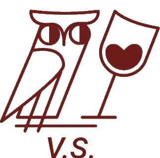

# About Us

**Scott B. Nelson**
Scott B. Nelson is Director and Founder of the Vienna Symposium. He has nourished a lifelong passion for the classics in everything from philosophy to the arts. In 2013 he began hosting small informal symposia with friends to discuss great works. This would later grow into the Vienna Symposium. He also likes wine.

**Matt Edwards**
Matt Edwards is Deputy Director and Co-Founder of the Vienna Symposium. Based in Vienna since 2013, an enjoyment of discussing ideas while sharing good wine and food led to being involved in the Vienna Symposium's gestation. His academic background is in history and for fun during Covid-times he did another degree in Viking Studies. His ambition is to complete further studies that have absolutely no relevance to his work.

**Dilan Abut**
Dilan Abut is Secretary and Co-Founder of the Vienna Symposium. Trained in law, she also has a keen interest in the classics, ancient works, and thought-provoking literature. She has always been and always will be passionate about reading.

**Nikolaus Kasyan**
Nikolaus Kasyan is Treasurer and Co-Founer of the Vienna Symposium. Computer Scientist and Software Developer by passion, currently pursuing a Master's in Artificial Intelligence. Always open to meaningful (or not so meaningful) discussions about any topic and eager to keep learning.